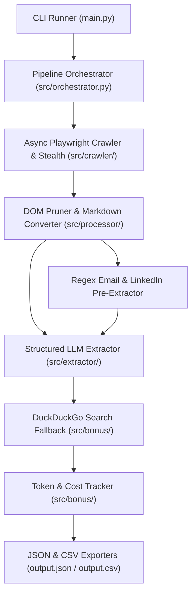

# Autonomous Lead Enrichment Agent

[](https://www.python.org/downloads/)
[](https://playwright.dev/python/)
[](https://docs.pydantic.dev/)
[](https://opensource.org/licenses/MIT)

A resilient, production-grade autonomous intelligence agent designed to enrich corporate domains with structured intelligence.
Given a list of company domains (e.g., `postman.com`, `supabase.com`, `vapi.ai`), the agent:
1. **Automated Browsing:** Spawns a headless Chromium browser using **Playwright** with stealth configurations to execute dynamic client-side JavaScript.
2. **Subpage Discovery:** Autonomously discovers high-signal subpages (`/about`, `/team`, `/contact`, `/pricing`) using keyword-weighted link scoring.
3. **Token-Optimized Preprocessing:** Strips 85–95% of HTML bloat (CSS, SVGs, scripts, cookie banners) and converts the DOM into compact Markdown with deterministic regex pre-extraction (zero raw HTML dumps).
4. **Structured LLM Extraction:** Enforces strict **Pydantic v2** data contracts across **Google Gemini**, **OpenAI**, or **Groq** to extract:
   - **Company Overview** (strict 2-sentence summary)
   - **Target Audience / ICP** (Ideal Customer Profile)
   - **Contact Points** (verified generic/public emails)
   - **Key Leadership & Team Members** (names, roles, and LinkedIn URLs)
   - **Data Confidence Score** (0.0 to 1.0 based on field completeness)
5. **Bonus Differentiators:**
   - **Search Integration:** DuckDuckGo search fallback to look up external LinkedIn URLs for founders/CEOs if missing on the website.
   - **Cost & Token Accounting:** Real-time token usage and API cost tracking per scraped domain.
   - **Zero-Crash Resilience:** Sandboxed domain execution with exponential backoff; failures never terminate a batch run.

---

## 1. Project Architecture



---

## 2. Directory Structure

```
SoftwareBrio/
├── main.py                       # CLI entrypoint with Rich terminal interface
├── requirements.txt              # Pinned production dependencies
├── pytest.ini                    # Test runner configuration
├── .env.example                  # Environment configuration template
├── .gitignore                    # Secrets, virtual environments, and cache exclusions
├── output.json                   # Enriched intelligence output (JSON)
├── output.csv                    # Enriched intelligence output (CSV)
├── src/
│   ├── config.py                 # Pydantic Settings & environment loader
│   ├── models.py                 # Pydantic v2 schemas (CompanyIntelligence, TeamMember)
│   ├── orchestrator.py           # Master async batch coordinator
│   ├── crawler/
│   │   ├── browser.py            # Playwright lifecycle & anti-detection stealth
│   │   ├── page_fetcher.py       # Resilient page fetcher with dual wait strategy
│   │   └── link_finder.py        # Keyword-weighted subpage discovery engine
│   ├── processor/
│   │   ├── cleaner.py            # DOM pruner (strips scripts, styles, SVGs, modals)
│   │   ├── markdown.py           # Hybrid Trafilatura + BeautifulSoup markdown converter
│   │   └── heuristics.py         # Regex email and LinkedIn pattern extractor
│   ├── extractor/
│   │   ├── llm_client.py         # Multi-provider client (Gemini / OpenAI / Groq)
│   │   ├── prompts.py            # Grounded extraction prompts and templates
│   │   └── schema_enforcer.py    # Pydantic validation & rubric confidence scorer
│   ├── bonus/
│   │   ├── search_fallback.py    # DuckDuckGo founder LinkedIn discovery engine
│   │   └── cost_tracker.py       # Real-time token usage and cost accounting
│   └── utils/
│       ├── logger.py             # Rich colored console logger
│       └── exporter.py           # JSON and CSV export utilities
└── tests/
    ├── test_phase2.py            # Unit tests for crawler & preprocessor
    ├── test_phase3.py            # Unit tests for schemas & enforcer
    ├── test_phase4.py            # Unit tests for search, cost tracker, and exporters
    └── test_playwright_live.py   # Live Playwright browser smoke test
```

---

## 3. Quick Start & Setup Guide

### Prerequisites
- Python 3.10+ (Tested on Python 3.14)
- Git

### 1. Clone the Repository
```bash
git clone https://github.com/Aakash15-Semwal/SoftwareBrio.git
cd SoftwareBrio
```

### 2. Create and Activate Virtual Environment
```bash
# Windows
python -m venv .venv
.\.venv\Scripts\activate

# Linux / macOS
python3 -m venv .venv
source .venv/bin/activate
```

### 3. Install Dependencies & Playwright Browser
```bash
pip install -r requirements.txt
playwright install chromium
```

### 4. Configure Environment Variables
Copy `.env.example` to `.env`:
```bash
cp .env.example .env
```
Open `.env` and set your preferred provider's API key:
```env
DEFAULT_LLM_PROVIDER=gemini
GEMINI_API_KEY=your_gemini_api_key_here

# Or if using OpenAI / Groq:
# DEFAULT_LLM_PROVIDER=openai
# OPENAI_API_KEY=your_openai_api_key_here
# DEFAULT_LLM_PROVIDER=groq
# GROQ_API_KEY=your_groq_api_key_here
```

---

## 4. Running the Agent

### Run Against the 3 Test Targets (Default)
To run against `postman.com`, `supabase.com`, and `vapi.ai`:
```bash
python main.py
```

### Run with Custom Domains
```bash
python main.py --domains stripe.com linear.app resend.com
```

### Run from a Domain File
```bash
python main.py --file domains.txt
```

### Advanced CLI Options
| Flag | Description |
| :--- | :--- |
| `--domains <list>` | Space-separated list of target company domains. |
| `--file <path>` | Path to a text file containing domains (one per line). |
| `--provider <name>` | Override active LLM provider (`gemini`, `openai`, `groq`). |
| `--no-search` | Disable DuckDuckGo search fallback for leadership. |
| `--headful` | Launch Chromium in visible UI mode (default is headless). |

---

## 5. Sample Output & Deliverables

After running, the agent automatically creates two output files:
- **`output.json`**: Hierarchical JSON containing full company profiles, leadership arrays, and token metadata.
- **`output.csv`**: Tabular export ready for Google Sheets or CRM import.

### JSON Schema Sample:
```json
{
  "domain": "supabase.com",
  "company_name": "Supabase",
  "company_overview": "Supabase is an open source Firebase alternative providing developers with a complete backend toolkit. It offers dedicated Postgres databases with instant RESTful and real-time APIs.",
  "target_audience_icp": "Software engineers and developers building modern web and mobile applications requiring real-time databases and authentication.",
  "contact_points": [
    "support@supabase.com",
    "sales@supabase.com"
  ],
  "key_leadership": [
    {
      "name": "Paul Copplestone",
      "role": "CEO & Co-founder",
      "linkedin_url": "https://www.linkedin.com/in/paulcopplestone"
    },
    {
      "name": "Ant Wilson",
      "role": "CTO & Co-founder",
      "linkedin_url": "https://www.linkedin.com/in/antwilson"
    }
  ],
  "data_confidence_score": 0.95,
  "confidence_reasoning": "Complete overview, validated ICP, verified contact points, and leadership profiles grounded in site data.",
  "metadata": {
    "pages_crawled": [
      "https://supabase.com",
      "https://supabase.com/about",
      "https://supabase.com/pricing"
    ],
    "llm_provider": "gemini",
    "model_name": "gemini-1.5-flash",
    "total_tokens": 3412,
    "estimated_cost_usd": 0.00038
  }
}
```

---

## 6. Running Tests

Run the full automated test suite (14 unit and integration tests):
```bash
pytest
```

---
